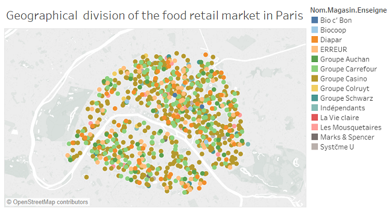

# Data-Visualization-of-the-food-retail-market-in-Paris
Geographical division of the food retail market in Paris.  I gathered data (including adresses) on all the Parisian shops from <a href="https://www.data.gouv.fr/fr/">data.gouv.fr</a>. I filtered on all the shops of the food retail industry. Finally, I have collected the GPS coordinates through the Google Maps API from the adresses of the shops. Here is an overview of the final Data visualization :
 
 

